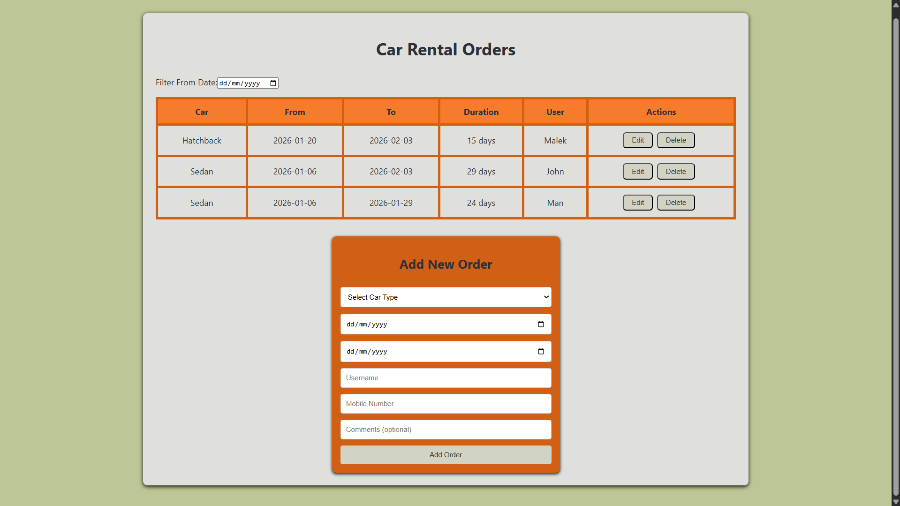
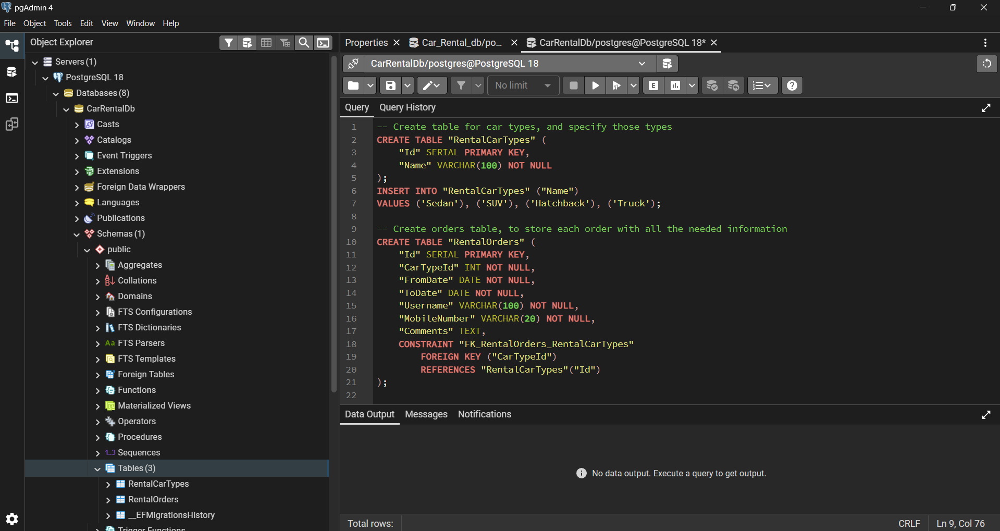

# Car Rental Demo

## Description:
This is a web app meant to show my ability to handle working with React, .NET, and other technologies that will be listed below. 

What the app does is: 
- Allow the user to place an order on one of 4 types of cars, and attach their information to it, as well as for how long they'd like to rent it out. 
- Handle this information and immediately display it in the table positioned above, without the need to refresh the page.
- Allow the user to filter the table contents based on the "From Date" that the user can choose.
- Allow the user to both delete and edit table entries, while seamlessly updating the table accordingly.

## Technologies used:
**1. Frontend:**
    - React (19.2.3) as the Framework + React Hooks:
        - useState
        - useEffect
        - useCallBack
    - TypeScript (5.9.3) for props, state, and API responces
    - Axios (1.13.2) to communicate with the backend endpoints

**2. Backend:**
    - .NET 8 (8.0.416) as the Framework
    - ASP.NET Core Web API (8.0.22) to build REST endpoints
    - Entity Framework Core (8.0.8) for database interactions and relational mapping

**3. Database:**
    - PostgreSQL (via pgAdmin 4 ver 9.8)
    - Access via EF Core
    - Fairly simple, only 2 tables needed for this project:

    

## Final Note:
Despite my lack of first hand experience with either React or ASP.NET, and the addition of time pressure to finish this project within a few days, I am confident I had delivered a satisfactory solution.

It took quite a bit of research, trial and error, but MOST IMPORTANTLY applying my existing knowledge of FullStack Development onto these new technologies. And thanks to the combination of all this effort, it all came together quite nicely.

I have learned a lot in this incredibly short time and am now more than willing to dive much deeper into this side of software engineering. Considering that this project merely scratches the surface of what can be done with these tools, I already plan to explore and push the limits of what I can do with it myself.
